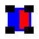
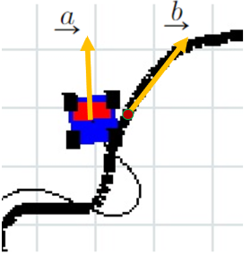
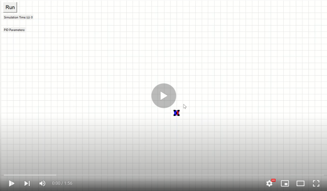
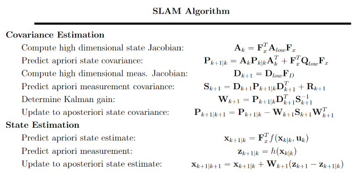
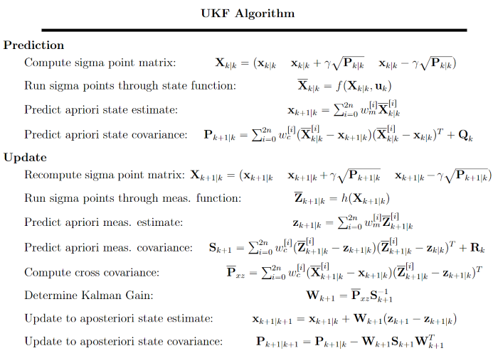

# RobotVision

<p  align="justify">
The goal of RobotVision is to simulate control, path-planning, localization and mapping of a non-holonomic robot in a 2D world. The topics explored here are well known in the robotics industry but I figured that this is a good opportunity explore them myself in more detail. Here, I attempt to provide the mathematical framework behind RobotVision.

<p  align="justify">
The project was built from scratch using Python's Tkinter library. I found this the most versatile library in Python to create animations and it very much exceeded expectations.

<p  align="justify">
As a side note, I adopt Prof. Gabriele D'Eleuterio's math symbol scheme for consistency and stylistic elegance.


## What am I?
<p  align="justify">
I am a robot made of six rectangles; one body, one head and four wheels. This is what I look like.

<p  align="center">


<p  align="justify">
I can move forward and rotate about a point that is not my centroid, but not in reverse. With these maneuvers, I can traverse the entire 2D world. But I can't do it on my own; I only understand how to follow dark coloured markers on the ground.

<p  align="justify">
I am equipped with a LIDAR sensor, one that can measure distance to objects and the relative angle of myself to them, as well as a colour sensor that tells me how close I am to the dark markers.

<p  align="justify">
Let's help the robot achieve control, path planning, localization and mapping.

## How do I move?

### Defining the Robot's Model

<p  align="justify">
The vehicle has three manuevers; rotate clockwise, rotate counter-clockwise and drive straight. Thus, the most logical control input  is a vector with velocity, , and angular velocity, .

<p  align="justify">
The trick to achieving angular control when the vehicle's foreign metric system is in pixels is in the rotation matrix. The Tkinter grid is positioned such that positive is to the right and down, whereas the conventional form is to the right and up. Thus, the conversion to the pixel reference frame comes down to a vertical flip. The CW and CCW 2D rotation matrices can be deduced as:

<p  align="center">
	  &nbsp; &nbsp; &nbsp;
	

<p  align="justify">
These rotation matrices can be applied to each of the "six rectangles" that the robot composes of to achieve rotation! Note that although the math to follow from here will ignore the discrepancy from the vertical flip, we must be mindful that we use the negative y-direction in all of our equations when we are actually programming this.

### PID Control
<p  align="justify">
If we want to setup a PID controller, we need two things; a variable to control and a defined path for the robot to follow. Since the velocity of our robot is constant, the only variable that needs control is our angular velocity. Also, we can define the path for the bot to follow by drawing on the Tkinter canvas itself, and the path can be stored in an array as a set of points.

<p  align="justify">
There is one problem that we need to overcome - how do we know when to command the robot to turn clockwise or counterclockwise? In reality, the robot has a colour sensor on it so it can know whether to rotate right or left depending on where it detects the dark colour in its field of view. Doing this in simulation is very different since we don't actually use sensor readings. Here we make use of the cross product!

<p  align="center">


<p  align="justify">
At each iteration of our PID control loop, we find the point on the path that is the shortest distance away from the robot, and determine the vector that goes through this point and is tangent to the path. This is our 'b' vector. Then we find the vector that describes the heading of the robot, and this is our 'a' vector. To enable the use of the cross product, we add a third dimension to our vectors. If you can visualize the right hand rule, notice that computing  will always be negative if the robot is to the left of the path, positive if it is to the right of the path, and zero if it is perfectly aligned with the path.

<p  align="justify">
The state model with state, , for our system given our control input can be defined as the following:

<p  align="center">


<p  align="justify">
We define , which basically is the correction factor (either +1 or -1) that identifies if the robot is moving clockwise or counterclockwise.

Implementing this in code is well known:
	
```python
# The PID Control Loop
error = distance_from_path()
control = kp * error + ki * integral + kd * derivative
integral += error * dt
derivative = (error - last_error) / dt
last_error = error
```
<p  align="justify">
We can easily modify the code block to integrate using the trapezoidal rule or the midpoint rule, as opposed to the standard Riemann sum to get better approximations of the integral (and likewise with the derivative, but using euler forward or Runge-Kutta, etc). 

<p  align="justify">
From here, after tuning our PID gains sufficiently enough of course, we can draw any path on the screen and the robot should be able to follow it!

<p  align="center">
<a href="https://www.youtube.com/embed/df07yQ8M38M">
         
</a>

### Lead-Lag Control
<p  align="justify">
I remember in my Control Systems class that we were taught the lead-lag controller and how it can approximate a PI or PD controller, but is much more stable since it eliminates a lot of the problems that experience with the Integral or Derivative terms. But I never really understood how to actually implement this in code. So far, I haven't found any source code online that actually allow you to implement a lead-lag controller in a way similar to the PID controller - this section aims to fix that.

<p  align="justify">
The PID controller can be described in the Laplace domain as:
 
<p  align="center">


<p  align="justify">
The  term means that we are integrating over the error, and this is made clear once we convert this back to the time domain using our Laplace transform tables. But let's do this in a slightly different way, using the convolution theorem. It tells us:

<p  align="center">


In the case of our PID integral term, lets set  and . We also know that:

<p  align="center">

 
<p  align="center">
.

This leads to the following equation for our output:
<p  align="center">


<p  align="justify">
Thus, all we need to do for our integral term is sum up the error over all time. As you may have noticed from the PID code block earlier, this is precisely why we continue to add the current integral term onto our previous integral term.

<p  align="justify">
Let's try to apply the same idea to our lead lag controller, which can be described by the following in the Laplace domain:

<p  align="center">


This time, the  term is our proportional controller, and  becomes our integral controller. Now,

<p  align="center">


<p  align="center">


and,

<p  align="center">


<p  align="center">


where 0"/>. This leads to the following equation for our output:

<p  align="center">


<p  align="center">


<p  align="justify">
But, as you may have noticed, there's a small problem. Because we are multiplying two functions now and we are also time shifting g(t), the past multiplication terms will also change! This wasn't a problem earlier because in the PID case we had g(t) = g(t-tau) = 1 and we didn't have to consider this. To prevent us from having to keep a running history of our error terms, we can make use of a very convenient property of exponentials (credit to @gunvirranu for pointing this out)!

Expanding the error terms at time i,
<p  align="center">


as well as at time i+1,
<p  align="center">


it very nicely follows that:
<p  align="center">


And so, we are well equipped with implementing this in code:

```python
# The Lead Lag Control loop
error = distance_from_path()
control = K * (error + (a-b) * integral)
integral = integral * np.exp(-b * dt) + error
```
<p  align="justify">
And thats it! The simplicity of the lead-lag controller is hidden in the math.

<p  align="center">
<a href="https://www.youtube.com/embed/GudSzbR40U0">
         
</a>

<p  align="justify">
More investigation into how to properly tune the gains for the lead-lag controller needs to be done.

### Discretizing the Transfer Function

<p  align="justify">
In reality, digital systems are discrete and not continuous. It is no different here. We can use the bilinear transform to discretize our system, which has the added benefit of an accuracy boost since it is derived from the trapezoidal rule. As an example, let's use it to discretize our lead-lag controller.

Our continuous transfer function is:
<p  align="center">


Applying the bilinear transform:

<p  align="center">


Finally, determining the difference equation:
<p  align="center">


leading to:
<p  align="center">


Implementing this is simple as we can use the trick with our PID controller; we just keep track of the previous output and error terms. I'll leave coding this up as an exercise to the viewer.

## How do I get from here to there?

### Dubin's Path Calculator
<p  align="justify">
The idea behind Dubin's path is very simple; what is the shortest distance path between any two points on a 2D grid, given your vehicle has a minimum turning radius. Given that there are only six types of curves to consider according to Dubin, the problem really comes down to circle geometry. There are two types of curves; CSC = Curve, Straight, Curve and CCC = Curve, Curve, Curve. I set out to handle this graphically in Desmos before attempting to program it. I don't really understand why, but the amount of time I spent on these Desmos visualizations is probably about half in comparison to the amount of time I spent on this entire project.

<p  align="center">
<a href="https://www.desmos.com/calculator/dqbshvxzmd">
         
</a> <a href="https://www.desmos.com/calculator/xfw2mw9dti">
         
</a>

I implemented this in three steps:
1. Draw all "pseudo-legal" Dubin's paths (ones do not consider vehicle's initial orientation) between start and end point.
2. Eliminate illegal paths.
3. Compute distance for all paths and identify minimum.

### Rapidly Exploring Random Trees
TBD

## Where am I?

### Extended Kalman Filter (EKF)
<p  align="justify">
As defined in the PID control section, our state update equation can be given as the following, this time with a state Gaussian noise term:

<p  align="center">


<p  align="justify">
Since we are working in 2D, we require a 2D measurement model. Luckily, our LIDAR sensor can measure relative angle and distance, leading to the following measurement model:

<p  align="center">


<p  align="justify">
where   is the position of a LIDAR detectable object. Note that in implementation we use the atan2 function instead of atan to account for directionality. Given this, the Jacobian matrices with respect to state space and measurement space can be derived:

<p  align="center">


<p  align="center">


<p  align="justify">
Finally, given an initial state covariance, , process noise, , and measurement noise, , we can apply the EKF algorithm:

<p  align="center">


<p  align="center">
<a href="https://www.youtube.com/embed/xIxnYnVbS8k">
         
</a>

<p  align="justify">
In the demo, the red circle represents a LIDAR detectable station, the black circular outline represents the detectable range of the station and the cyan trace is the predicted state. When the robot is outside of the detectable range, it cannot update the state with the Kalman gain since it doesn't receive any sensor readings, and so it predicts normally with  without accounting for error. Notice how, when the robot enters the detectable range, it very visibly starts correcting the state and it eventually converges quite amazingly at the end, despite large deviations during traversal outside of the detectable range.

### Simultaneous Localization and Mapping (SLAM)

<p  align="justify">
The conversion from EKF to SLAM isn't a difficult one, so long as we are continuing to filter and not smooth. Pose graph optimization based SLAM, falling under the smoothing category, is more widely used in practice because it is more robust and less error prone to the limitations of the Kalman filter. Regardless, I decided to implement EKF based SLAM, because understanding it will help me grasp the fundamentals, and more importantly, better appreciate the need for something better.

<p  align="justify">
The biggest difference in implementation from the EKF is the fact that we need to additionally track the positions of the objects we observe. In the case of a robot exploring an unknown environment, we wouldn't know the number of objects to keep track of beforehand and so we would need to constantly update the sizes of our matrices. For simplicity, let's assume that we know the number of objects that require tracking in our map. We need to keep track of 2N additional things - the x and y coordinates for each of our N objects. Our conversion matrix from our EKF state space to this higher order space can be defined as the following:

<p  align="center">


<p  align="justify">
Next, we need some way of defining , but only to allow updates for objects in our current field of view. As such, we define the following matrices:

<p  align="center">


This is enough to implement EKF-SLAM:

<p  align="center">


<p  align="center">
<a href="https://www.youtube.com/embed/o0ACDtnDxwk">
         
</a>

<p  align="justify">
In the demo, the cyan trace represent the predicted state and the blue dots represent the predicted state of the landmarks. Despite large errors towards the end caused by no measurement update, the robot is able to quickly localize and converge on the landmark locations with reasonable accuracy.


### Unscented Kalman Filter (UKF)

<p  align="justify">
Since we have a highly non-linear model, the EKF tends to linearize in unwanted places and in general, the Jacobian matrix tends to under approximate the true state of the robot. As such, it only makes sense to explore the UKF since it eliminates the need for Jacobians and is almost always beats the EKF.

Here is the algorithm:

<p  align="center">



<p  align="justify">
There are still one or two bugs that need to be fixed with my current implementation, but I hope to have a demo out soon!

### Particle Filter
TBD
  
  
## What's Next?

I've put the remaining items on our list on hold for now, and I may come back to completing them in the future.

### Progress
- [x] Dubin's Path Calculator
- [ ] Rapidly Exploring Random Trees Algorithm
- [x] PID Control
- [x] Lead-Lag Control
- [x] Kalman Filter (Extended, Unscented)
- [ ] Particle Filter
- [x] SLAM

## Acknowledgements
- Professor Gabriele D'Eleuterio: ROB301 lectures and primers
- Professor Cyrill Stachniss: YouTube series on Kalman Filtering and SLAM
- Professor Angela Shoellig: ROB310 lectures and class demos